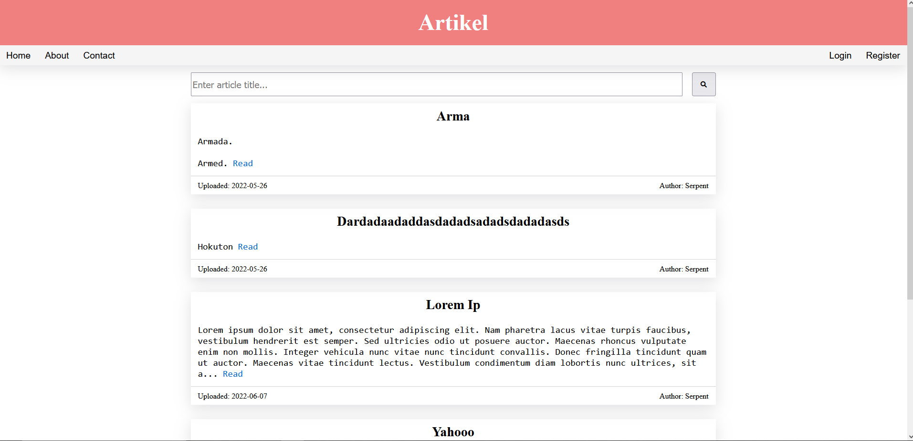
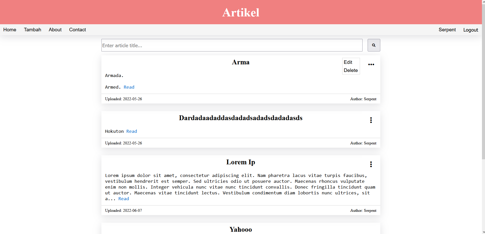
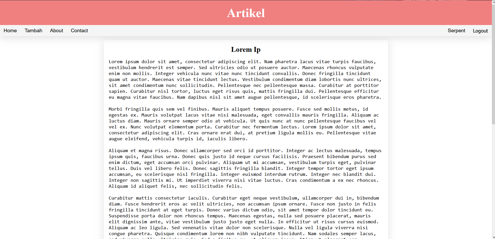
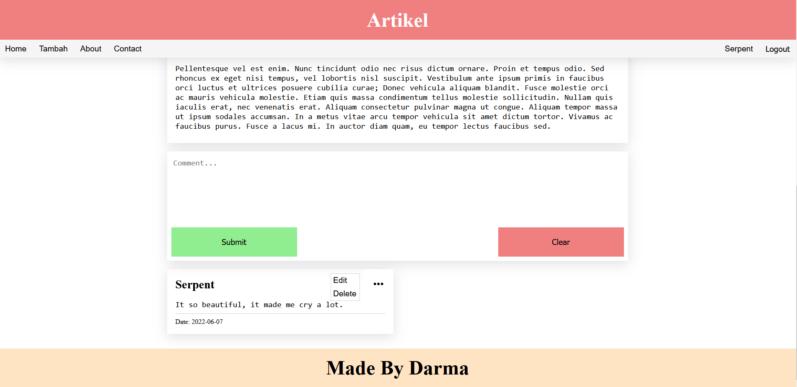
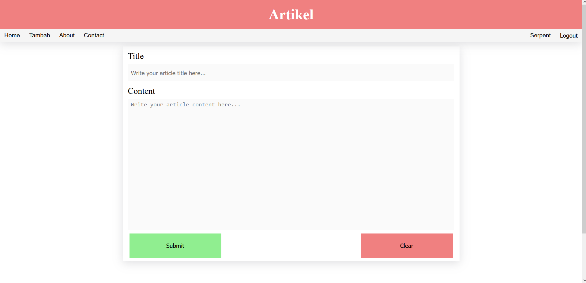
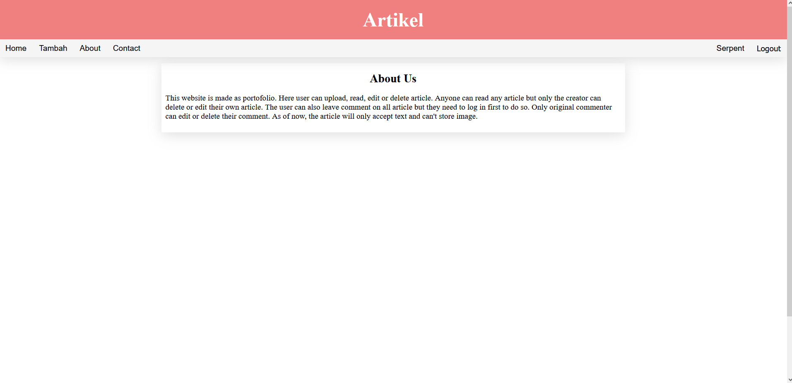
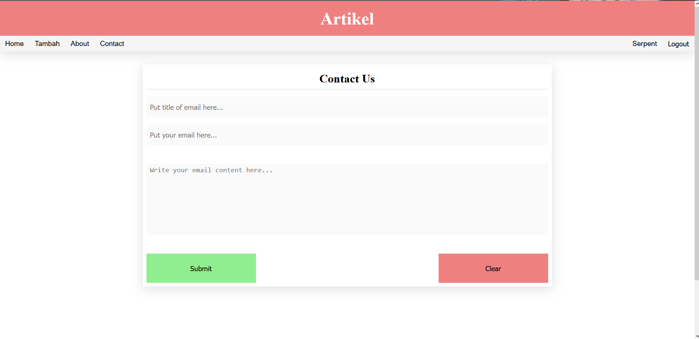
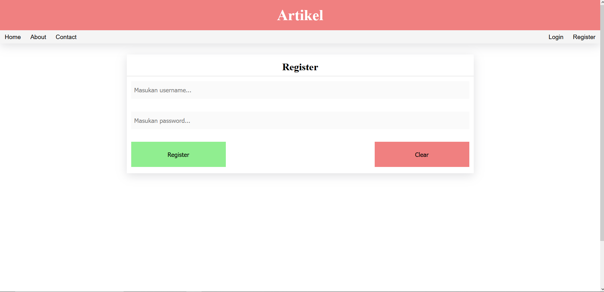

# Simple-Article
Sebuah website CRUD responsif sederhana dimana pengguna bisa menambah, menghapus dan mengedit artikel. Dibuat dengan menggunakan Html, Scss, Javascript(Vanilla), PHP(OOP) dan Mysql.

Link hosted: http://simple-artikel.infinityfreeapp.com/

Berikut adalah halaman yang ada di website:

# Home

Pada menu ini, pengguna bisa melihat summary dari artikel-artikel yang sudah diupload oleh pengguna lainnya. Untuk membaca semua isian dari suatu article, pengguna bisa menekan tombol Read yang ada di samping artikel.

Untuk pengguna yang sudah login, mereka juga bisa mengedit atau menghapus artikel yang mereka buat dengan cara menekan icon ":" yang ada pada bagian kanan atas artikel dan memilih aksi yang ingin dilakukan lewat submenu yang muncul.

# Read

Disini pengguna bisa membaca isi artikel dan apabila pengguna sudah login, maka bisa memberikan comment. Pengguna juga bisa mengedit atau menghapus comment yang mereka berikan.

# Tambah

Pada menu ini pengguna bisa membuat artikel. Selain itu pengguna juga bisa mengedit artikel mereka dengan cara menekan tombol edit pada submenu artikel di halaman Home.

# About

Halaman ini berisi deskripsi tentang website Simple-Article.

# Contact Us

Pada halaman ini pengguna bisa mengirimkan email ke pembuat website dengan cara mengisi form yang ada.

# Login

Pada halaman ini pengguna bisa melakukan login agar dapat mengakses berbagai fitur dari web. Pengguna bisa menggunakan username Jumanji dan password juju untuk login.

Username dan password yang bisa digunakan:

 1. Username Jumanji dengan password juju
 2. Username Serpent dengan password Uc52kDRBgiqKPUp

# Register

Pada halaman ini pengguna bisa melakukan registrasi. Setelah registrasi berhasil pengguna akan secara otomatis di login oleh website.
